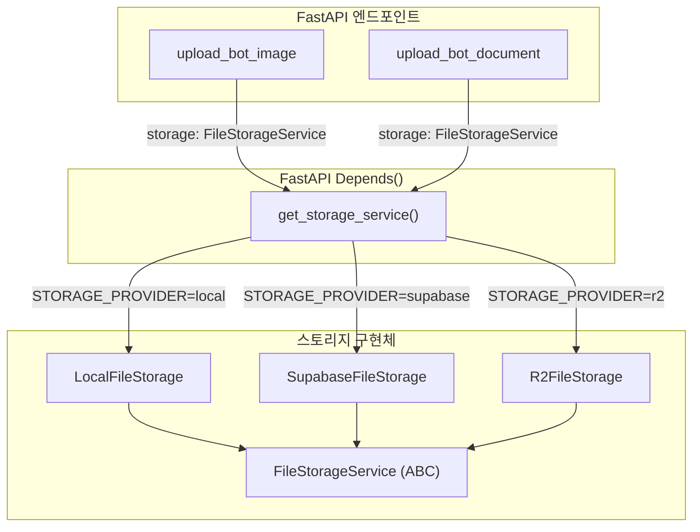

# 파일 스토리지 아키텍처

## 구조 개요

## 환경변수

| 변수명                    | 기본값      | 설명                                          |
| ------------------------- | ----------- | --------------------------------------------- |
| `STORAGE_PROVIDER`        | `supabase`  | `local` / `supabase` / `r2`                   |
| `UPLOAD_DIR`              | `./uploads` | local 전용 — 파일 저장 디렉토리               |
| `MAX_UPLOAD_SIZE_MB`      | `10`        | 최대 업로드 크기                              |
| `SUPABASE_URL`            | —           | Supabase 프로젝트 URL                         |
| `SUPABASE_SERVICE_KEY`    | —           | Service Role Key                              |
| `SUPABASE_STORAGE_BUCKET` | `uploads`   | 버킷 이름                                     |
| `R2_ACCOUNT_ID`           | —           | Cloudflare 계정 ID                            |
| `R2_ACCESS_KEY_ID`        | —           | R2 API 토큰 Access Key                        |
| `R2_SECRET_ACCESS_KEY`    | —           | R2 API 토큰 Secret Key                        |
| `R2_BUCKET_NAME`          | —           | R2 버킷 이름                                  |
| `R2_PUBLIC_URL`           | —           | 퍼블릭 액세스 URL (커스텀 도메인 또는 r2.dev) |

## upload() 반환값 규격

- **모든 구현체**는 `upload()` 호출 시 **접근 가능한 URL**을 반환
  - Local: `/static/uploads/{uuid}.ext` (서버 상대 경로)
  - Supabase: `https://<project>.supabase.co/storage/v1/object/public/uploads/{uuid}.ext`
  - R2: `https://<custom-domain>/{uuid}.ext`

## 하위 호환성

- `/static/uploads` 정적 마운트는 **STORAGE_PROVIDER 값과 무관하게 항상 유지**
- 기존 DB에 `/static/uploads/...` 형태의 상대 경로가 저장되어 있어도 정상 서빙
- 프론트엔드의 `startsWith('http')` 분기로 절대 URL과 상대 경로 모두 처리

## 관련 파일

- `app/core/config.py` — 환경변수 정의
- `app/services/storage/base.py` — 추상 클래스
- `app/services/storage/factory.py` — 팩토리 + DI
- `app/services/storage/local.py` — 로컬 구현체
- `app/services/storage/supabase.py` — Supabase 구현체
- `app/services/storage/r2.py` — R2 구현체
- `app/api/v1/endpoints/admin.py` — 이미지/문서 업로드 엔드포인트
