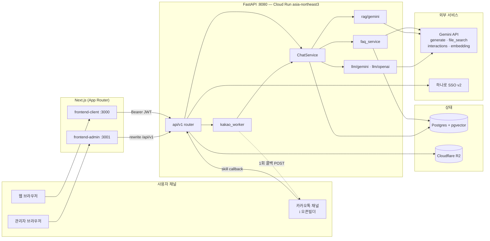
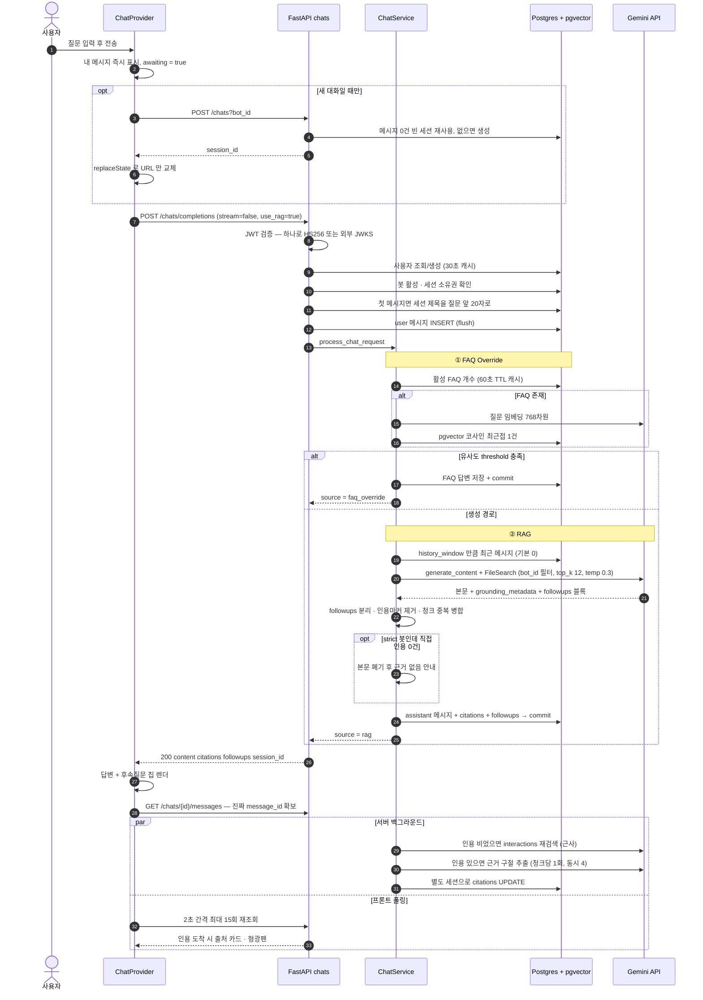
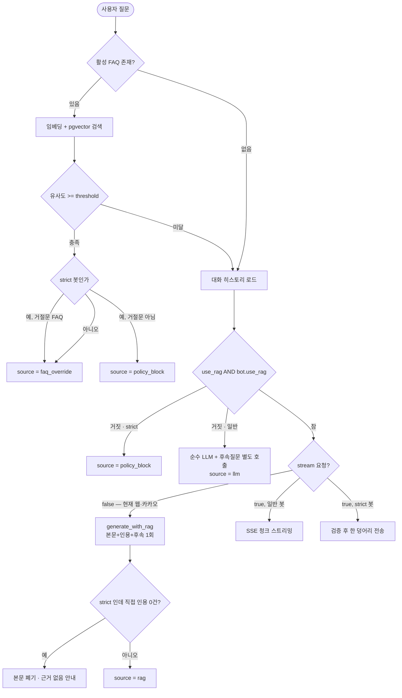
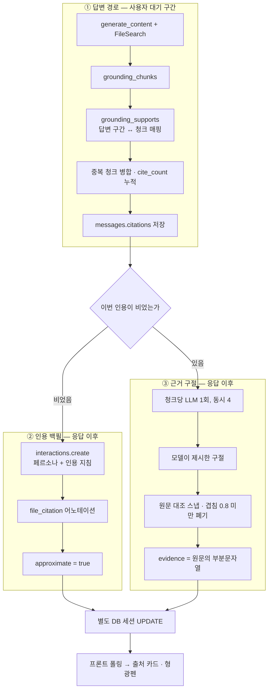
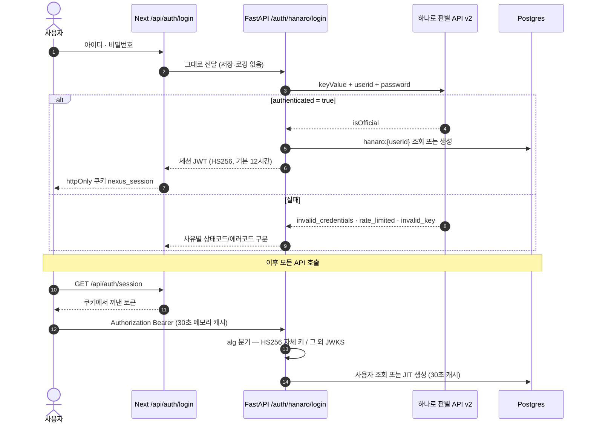
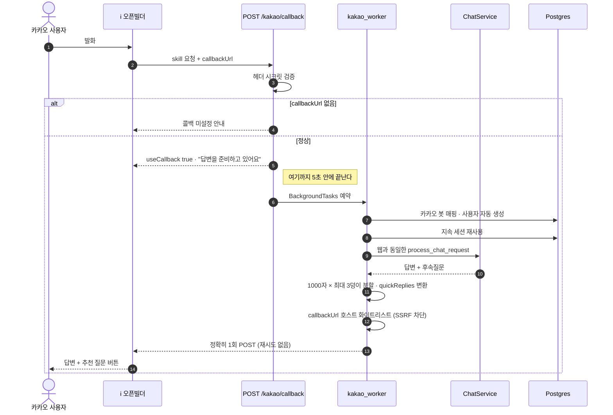
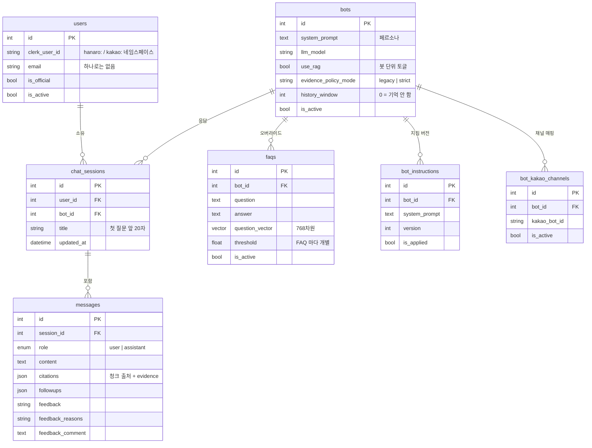
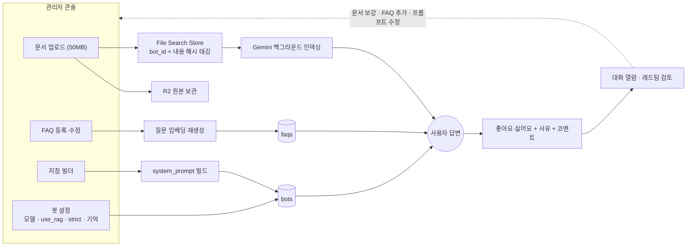

# Nexus Core — 아키텍처 & 요청 여정 (main / d37e4f6, 2026-08-04)

사용자가 질문을 보낸 순간부터 화면에 답변·출처·후속질문이 채워지기까지의 전 경로를 코드 기준으로 정리한다.
GitHub 에서 mermaid 가 렌더된다.

---

## 01. 시스템 구성

입구는 웹 채팅 / 관리자 콘솔 / 카카오톡 채널 세 갈래지만, 답변을 만드는 코드는 `ChatService` 한 곳이다.

- 관리자 프론트: Next `rewrites` 로 `/api/v1/*` 프록시
- 클라이언트 프론트: `NEXT_PUBLIC_API_URL` 절대 주소 직접 호출 (dev 프록시 30초 소켓 절단 회피)

---

## 02. 질문 → 응답 전 구간

웹 클라이언트는 `stream: false` 로 보낸다. 답변은 한 번에 오고, **출처만 나중에** 채워진다.

| 단계 | 위치 |
| --- | --- |
| 낙관적 렌더 · 세션 확보 · 인용 폴링 | `frontend-client/src/app/(protected)/chat/ChatProvider.tsx` |
| 봇·세션 검증, 제목 갱신, user 메시지 flush | `backend/app/api/v1/endpoints/chat.py` |
| alg 분기 JWT 검증 + JIT 사용자 | `backend/app/api/deps.py` |
| FAQ → RAG → LLM 분기, strict 게이트, 백필 예약 | `backend/app/services/chat_service.py` |
| 임베딩 + pgvector 최근접 + threshold | `backend/app/services/faq_service.py` |
| File Search 생성 · 인용 추출 · 근사 인용 | `backend/app/services/rag/gemini.py` |
| 근거 구절 추출 후 원문 스냅 | `backend/app/services/rag/evidence.py` |

---

## 03. 응답 경로 분기

응답 JSON 의 `source` 가 어느 갈래였는지 그대로 알려준다.

`use_rag` 는 **요청값 AND 봇 설정**. 문서 없는 봇은 `use_rag=false` 로 꺼야 빈 검색 비용이 사라진다.

---

## 04. 인용 파이프라인 (출처가 늦게 뜨는 이유)

- ②의 인용은 **표시된 답변이 아니라 두 번째 생성 답변** 기준 → `approximate=true`
- ③의 형광펜은 모델 문자열을 쓰지 않고 청크 원문 위치로 스냅 → 환각이 저장될 수 없음

### 대기 시간 구조

| 구간 | 내용 |
| --- | --- |
| BLOCKING | JWT 검증 → 봇·세션 조회 → user msg flush → FAQ 카운트/임베딩/pgvector → Gemini generate_content → 파싱 → commit |
| BACKGROUND | 인용 백필 (프론트 주석 기준 실측 ~15초), 근거 구절 추출 |
| CLIENT | 2초 × 최대 15회 폴링 (확보 즉시 중단) |

코드에 박힌 값: `RAG_TOP_K=12`, `RAG_TEMPERATURE=0.3`, 히스토리 메시지당 500자 컷, followup timeout 5초,
카카오 워커 데드라인 50초, 업로드 상한 50MB.

비스트리밍 경로는 후속질문을 RAG 호출 안 `<followups>` 마커로 같이 받는다(별도 LLM 호출 제거).

---

## 05. 인증

미들웨어는 쿠키 존재 여부만 검사(`/chat`, `/mypage`). 서명 검증은 백엔드가 매 요청 수행.

---

## 06. 카카오 채널 (5초 규약 우회)

데드라인 50초는 **생성에만** 걸리고, 전송은 데드라인 밖에서 한 번 → 중복 발송 불가.

---

## 07. 데이터 모델

RAG 문서 자체는 DB 가 아니라 **Gemini File Search Store 한 곳**에 모이고 `bot_id` 메타데이터로만 갈린다.
그 외 레드팀 운영 테이블군(질문·피드백·리뷰·테스트봇 평가)이 별도로 있다.

---

## 08. 운영 루프

코드 배포 없이 답변을 바꿀 수 있는 손잡이 넷: 문서 / FAQ / 지침·프롬프트 / 봇 설정.

업로드 기본은 **추가**다. 정리 목적일 때만 `replace=true` 를 명시해야 구버전이 지워진다.

---

## 09. 읽으며 확인된 것

| 항목 | 내용 |
| --- | --- |
| 관리자 API 인증 | `endpoints/admin/` 어느 라우트에도 `get_current_user` 가 없다. 코드만 보면 무인증 |
| SSE 경로 | 구현 3종 존재하나 웹·카카오 모두 `stream=False` → 현재 미사용 |
| 대화 기억 | `history_window` 기본 0 → 봇별로 켜지 않으면 매 질문 독립 |
| 인용 0건 | RAG 미작동이 아니라 grounding "보고" 누락일 수 있음. 백필 인용은 `approximate` |
| 카카오 세션 | `(user_id, bot_id)` UNIQUE 없음 → 동시 첫 발화 시 세션 중복 가능, 이후 최신 세션으로 수렴 |
| 빈 Store 검색 | 문서 없는 봇도 검색 호출 시간은 그대로 발생 → `use_rag=false` 권장 |
